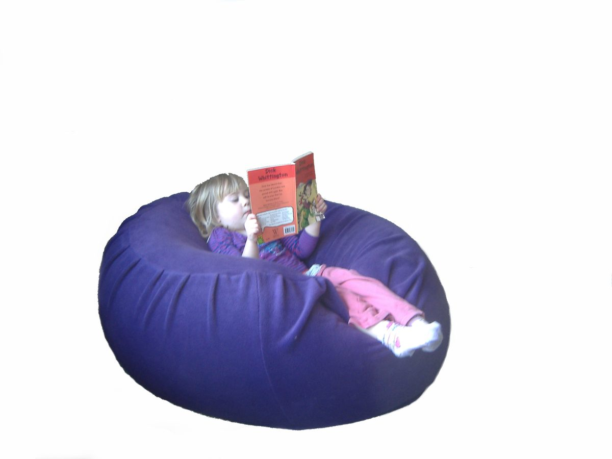

# Content to confirm with Julia

**Important context:** sensorybeanbags.com was unreachable from the machine this
site was built on (blocked by the network policy), so **none of the copy was
copied from the live site**. It was reconstructed from public search-engine
results and then rewritten. Everything below needs a pass from Julia before
this goes anywhere near a real domain.

Anything still unconfirmed is marked in the pages with an orange dashed
`to confirm` chip, so it is obvious on screen. Search the built HTML for
`class="tbd"` to find them all. Once a value is filled in, delete the
`<span class="tbd">…</span>` wrapper; when they are all gone, delete the
`.tbd` rule at the bottom of `assets/css/site.css`.

## 1. Prices — the biggest gap

Only two prices could be verified. Everything else is showing a placeholder.

| Product | Status |
|---|---|
| Beanbag, Large | €245 — confirm still current |
| Beanbag, X-Large | €280 — confirm still current |
| Beanbag, Medium | **needed** |
| Beanbag, XX-Large | **needed** |
| Beanbag, XXX-Large | **needed** |
| Lycra beanbags (all sizes) | **needed** — or keep as "price on request" |
| Weighted blankets | **needed** |
| Weighted lap pads | **needed** |
| Weighted snakes | **needed** |

Prices live in `src/pages/beanbags.html` and `src/pages/weighted.html`.

## 2. Dimensions

| Size | Status |
|---|---|
| Medium | "a little over 2 ft across, 16 in high" — confirm |
| Large | **needed** |
| X-Large | "3 ft / 1 m across, 48 cm high" — confirm |
| XX-Large | **needed** |
| XXX-Large | "110 cm / 56 in" — confirm |

Ideally give each size a weight and a bead volume too — people ask.

## 3. Photographs

There are **no real photographs** on the site yet. Every image is a dashed
placeholder box describing the shot that belongs there:

- Home hero — a child settled into a large fleece beanbag
- The beanbag range, several sizes together
- A weighted blanket, lap pad and snake together
- Fleece beanbag, close enough to show the texture
- Blue stretch lycra beanbag
- Weighted blanket / lap pad / weighted snake (one each)
- Julia at work, or a finished beanbag in the workshop

To drop a real photo in, replace the placeholder with a normal image tag:

```html

```

Write real alt text — many visitors to this site use screen readers or have
children who do. If a photo shows an identifiable child, get the parent's
written permission first.

## 4. Wording and policy

- **"Julia" or "Julie"?** The old site used both spellings, sometimes on the
  same page. This build standardises on **Julia**. Confirm which is right.
- **Returns / cancellations.** Nothing is stated anywhere. Made-to-order goods
  are exempt from the usual EU distance-selling cooling-off period, but the
  policy still has to be written down. Currently a placeholder on the FAQ.
- **Safety wording.** "CE approved" is carried over from the old site. Confirm
  what the certification actually covers, and whether there is fire-retardancy
  wording that should appear (bean bags are regulated for this in some markets).
- **Delivery outside Ireland.** Not mentioned anywhere. Northern Ireland and UK?
- **Lead time.** How long from order to dispatch? Buyers ask this constantly and
  it is not currently answered.
- **Washing instructions for the weighted products.** The beanbag washing
  instructions are from the old FAQ and should be accurate; the weighted ones
  are a sensible guess and need checking.
- **More testimonials.** Only one survived (Tania, on her son Mark). Julia is
  said to have a folder of them.

## 5. Legal

There is no privacy or cookie policy, because the site sets no cookies, runs no
analytics and has no forms — nothing is collected. If analytics or a contact
form is ever added, a privacy policy becomes necessary.

## 6. Before going live

- [ ] Delete `robots.txt` (it currently blocks all indexing — correct for a preview, wrong for the real site)
- [ ] Remove the `noindex` meta tag from `tools/build.py`, then rebuild
- [ ] Update `BASE_URL` in `tools/build.py` to the real domain
- [ ] Update the paths in `404.html` (they assume the `/sensorybeanbags/` preview subdirectory)
- [ ] Set up redirects from the old WordPress URLs — see `README.md`
